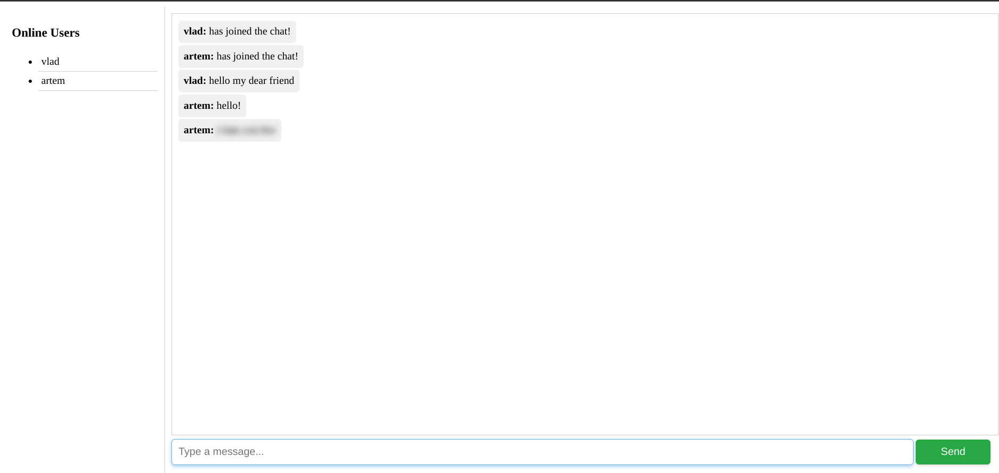
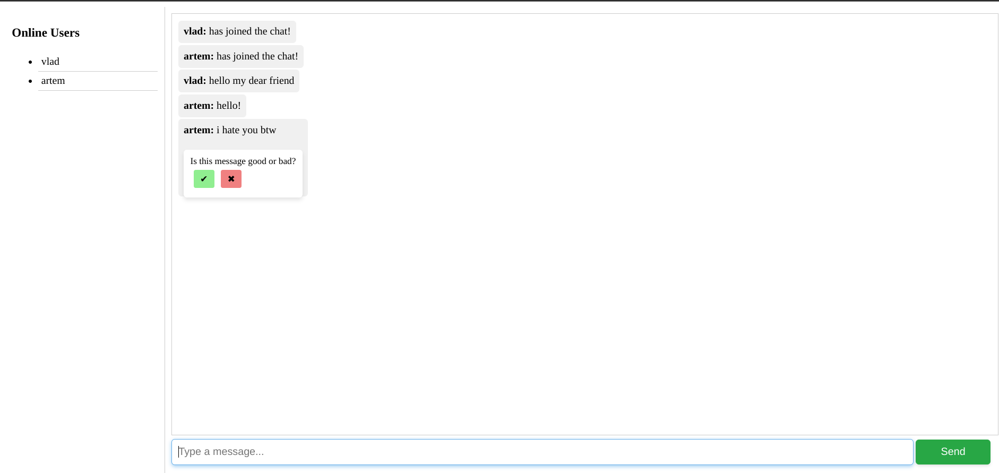
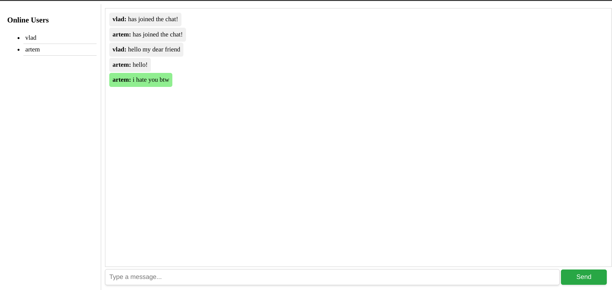
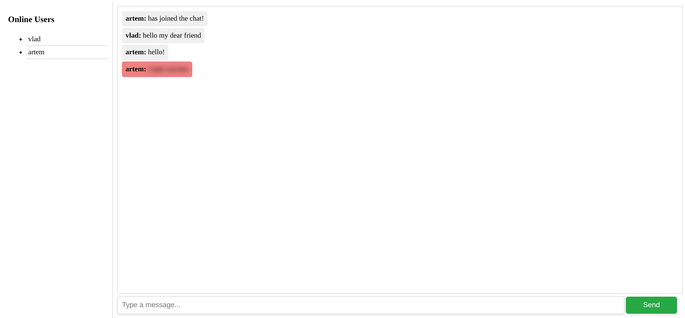

# AI-Driven Web Chat with Real-Time Harmful Content Prediction

This project is an AI-powered web chat application featuring real-time harmful content prediction. It allows users to engage in conversations while the system continuously monitors and flags harmful or inappropriate content.

## Features

- **Real-Time Content Moderation**: Automatically detects and flags harmful messages for review.
- **User-Driven Feedback**: Users can manually classify messages as appropriate or inappropriate, improving the model's performance over time.
- **Asynchronous WebSocket Communication**: Supports real-time messaging between users.
- **Frontend/Backend Separation**: Built with a FastAPI backend and a JavaScript frontend, utilizing WebSocket technology for live updates.
- **Dockerized Deployment**: Easily deployable using Docker containers.

## Screenshots

*Artem's second message is blurred because the model considers it harmful content. Each user can mark the message as harmful or not harmful, allowing the model to learn from the feedback and improve itself.*

*According to Artem's feedback, the message is just a friendly joke, so he marked it as not harmful.*

*However, Vlad thinks otherwise and marked the message as harmful.*

*Both users' feedback are sent to the model, enabling it to learn from them and improve its predictions.*

## How It Works

- **Message Filtering**: A fine-tuned BERT model analyzes chat messages in real time to predict harmful or inappropriate content.
- **User Feedback Loop**: Users can provide feedback on flagged messages, allowing the AI to continuously learn and adapt to the conversation style.
- **Real-Time Communication**: Messages are sent and received instantly using WebSockets for a smooth chat experience.

## Technologies Used

- **Backend**: FastAPI, WebSockets
- **Frontend**: JavaScript, WebSockets
- **Machine Learning**: Fine-tuned BERT model for harmful content prediction, trained on Google Cloud with CUDA acceleration
- **Deployment**: Docker
- **Testing**: pytest for WebSocket behavior and backend functionality

## Live Demo

You can access a live demo of the chat application by clicking the link below:

[Live Chat Application]()

## Contributing

Contributions are welcome! If you'd like to contribute to this project, please fork the repository and submit a pull request.