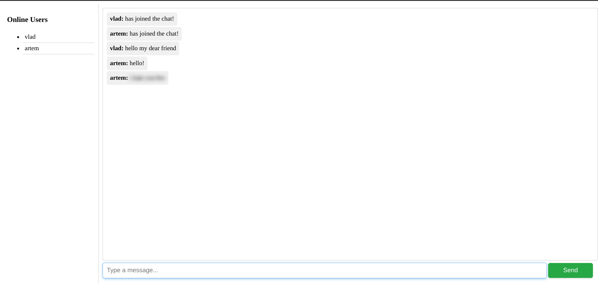
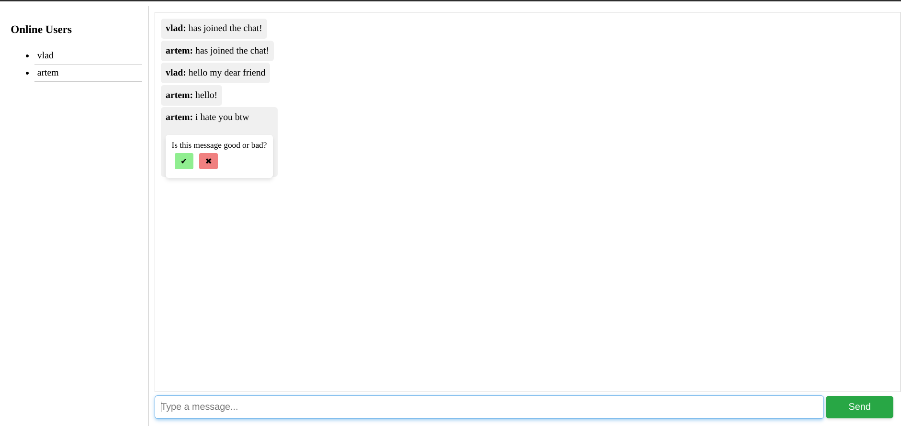
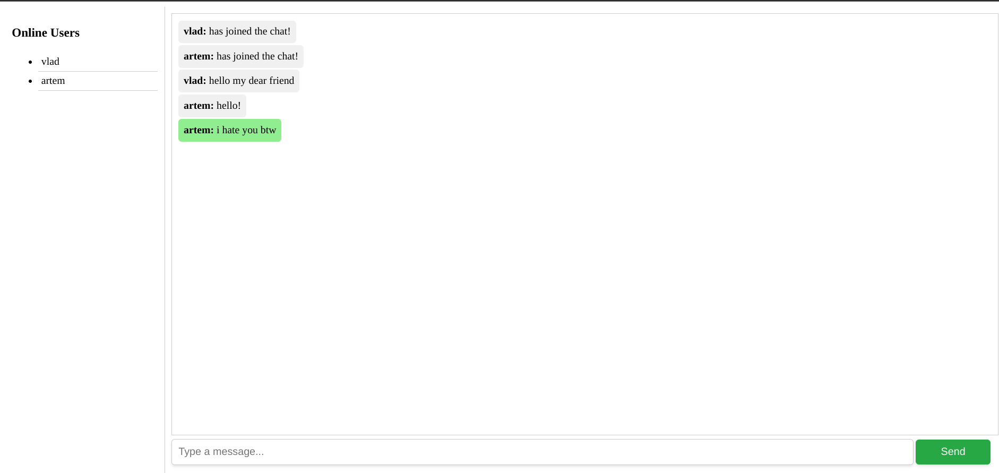
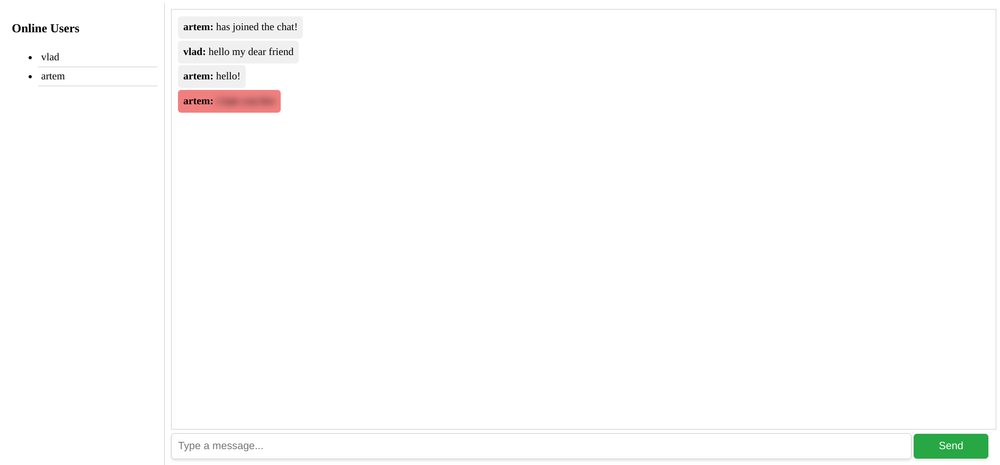

## Screenshots

*Artem's second message is blurred because the model considers it harmful content. Each user can mark the message as harmful or not harmful, allowing the model to learn from the feedback and improve itself.*

*According to Artem's feedback, the message is just a friendly joke, so he marked it as not harmful.*

*However, Vlad thinks otherwise and marked the message as harmful.*

*Both users' feedback are sent to the model, enabling it to learn from them and improve its predictions.*
